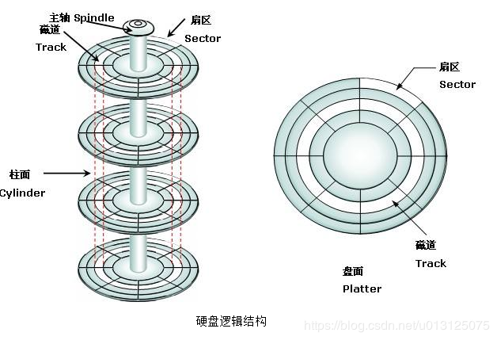

# 硬盘

> 今天我们来研究下硬盘。简单叙述，我也不太知道的硬盘历史，据说第一块硬盘是1956年，很大，从那时候ibm就创建了硬盘的基本架构。

### 1，机械硬盘

> 那些古老的硬盘架构我没去了解过，不管那么多。就说现在的机械硬盘。

**结构**

如图，不多说

  

**原理**

这里我要多说的是这个磁盘的读写原理。

平常读写的时候，磁头是不带电的，这个时候磁头切割磁感线产生感应电流，这一瞬间的电流方向就是一个二进制位，由此来读取数据。

写数据的时候磁头带电，使用电磁铁感应磁粉，磁粉，注意是粉，很小的颗粒，被电磁铁一感应就改变方向了，然后之后他就可以用这个磁场来发电了。发电其实就是感应出电流，读数据用。

### 2，固态硬盘

> 固态硬盘，这个东西是一个高科技产品，是电子级别的东西。

**闪存**