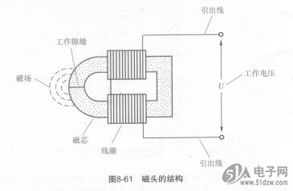
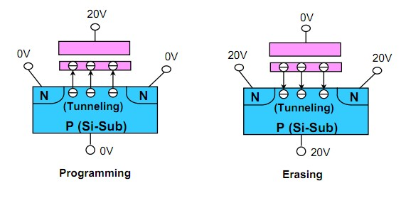

# 硬盘

> 今天我们来研究下硬盘。简单叙述，我也不太知道的硬盘历史，据说第一块硬盘是1956年，很大，从那时候ibm就创建了硬盘的基本架构。

### 1，机械硬盘

> 那些古老的硬盘架构我没去了解过，不管那么多。就说现在的机械硬盘。

**结构**

如图，不多说

  

**磁头**

磁头其实就是一个电磁铁，线圈+铁芯，如图:

  

由磁芯和绕在磁芯上的线圈组成，在磁芯前端有一极窄的工作隙缝。当有信号电压U加在磁头线圈上时，在工作隙缝处便产生相应的磁场，由沿工作隙缝移动的磁带记录下来。反之，当磁带上的磁场作用于磁头的工作隙缝时，在线圈上则感应出相应的信号电压。  

**原理**

这里我要多说的是这个磁盘的读写原理。

平常读写的时候，磁头是不带电的，这个时候磁头切割磁感线产生感应电流，这一瞬间的电流方向就是一个二进制位，由此来读取数据。

写数据的时候磁头带电，使用电磁铁感应磁粉，磁粉，注意是粉，很小的颗粒，被电磁铁一感应就改变方向了，然后之后他就可以用这个磁场来发电了。发电其实就是感应出电流，读数据用。

### 2，固态硬盘

> 固态硬盘，这个东西是一个高科技产品，是电子级别的东西。厉害得一批。

**闪存**

闪存，全名快闪存储器，flash memory，闪存有两类，NOR型与NAND型，他们区别很大得。那固态硬盘使用得NAND型。管他呢，反正我也不懂。闪存的最基本原理是隧道效应。

目前SSD所用的闪存主要是NAND类型，早前还有一种叫做NOR的闪存，最早是由Intel在1988年开发出来的，曾经在手机内存中大行其道，而NAND闪存则是东芝在1989年提出来的，两种类型的闪存争夺战中最终由NAND闪存胜出，Intel不得不把NOR闪存部分卖给美光转而投身NAND阵营，现在Intel的闪存无论性能还是口碑都不输东芝，甚至还能反超。

由于NOR事实上是明日黄花，这里也不需大幅描述它与NAND的差异了，只要知道几点就够了：NOR闪存是芯片内执行（Execute In Place），程序可以在闪存中直接执行而无需再入到系统内存中，而且可以字节数（byte）为单位读写，但是擦除和写入速度比较慢，容量密度低，反观NAND，存储密度高，写入和擦除速度更快，虽然写入以page为单位，但是擦除必须以block为单位。

**隧道效应**

隧道效应，百度百科说的很清楚。考虑粒子运动遇到一个高于粒子能量的势垒，按照经典力学，粒子是不可能越过势垒的；按照量子力学可以解出除了在势垒处的反射外，还有透过势垒的[波函数](https://baike.baidu.com/item/波函数/473629)，这表明在势垒的另一边，粒子具有一定的概率，粒子贯穿势垒。 

  

具体应用原理我就不说了，百度百科说的很清楚，查了很久都没搞清楚的是为啥闪存读写有次数限制。总算被我找到了。

**闪存读写上限**

它的存储原理是在栅氧化层中间弄一层悬浮的金属（具体工艺有好多步），可以是薄膜也可以是孤立的纳米点。使用的时候你在栅上加高电压，下方沟道里的载流子（电子或空穴）就会因为量子隧穿效应穿过绝缘层进入浮栅，注意在这个过程中绝缘层有漏电或者其他一些电流，但那不是主要的（有的新型器件会采用非隧穿的电流来操作）。一旦电压撤了，隧穿效应基本消失，于是浮栅里那些电荷就驻留了，几乎没有通路可以跑出来。这层电荷会改变浮栅型场效应管的开启电压，换句话说，有没有电荷可以通过加一个读电压－－大于无电荷时小于有电荷时的开启电压－－来判断，因为沟道电流在两种情况下差很大，串联个电阻上去就能读到不同的电位。要把电荷从浮栅上弄出来就得反向加高压，还是利用隧穿效应。如果你反复写－擦，非常薄的栅氧化层的绝缘性就会降低（晶格结构被反复冲击之类的各种电效应热效应），漏电会越来越大，最后封不住电荷，也自然就读不出来不同状态－－所谓失效。通常我们会用endurance表征这个器件耐擦写的能力。实验室里就是周期性地加上擦除写入电压，隔一阵测一下它能不能区分出两个状态（1和0的电位标准事先定好），直至它失效，这个擦写次数就是endurance。我当苦逼烟酒僧的时候，基本上一礼拜得弄那么三五次这样的实验，平均endurance都是几百万次，这是单个器件的，做成阵列以后总体上差不多，根据你写的区块频繁与否会比单管有所差异。 

总结下，就是说，隧道效应并不会损害势垒，如果理想状态下，这种器件是没有擦写上上限的，但是由于电子冲击会产生电热效应。这种热效应其实会对这个绝缘材料产生破坏（ **:smile:** 通俗一点）

然后还有使用高压让电子穿透绝缘材料，这个过程会对绝缘材料产生磨损，电子跑来跑去，怎么说还是会有影响的，这个可以用脚趾头想。

---

参看链接，特此感谢，相关内容，侵删。

- http://www.expreview.com/19604-10.html 

- 百度百科

-  https://www.guokr.com/question/465759/ ( [你们都知道我是谁的](https://www.guokr.com/i/1193651761/))
-  https://www.51dzw.com/embed/embed_84702.html (图)

> 如果有错，欢迎指出。
>
> 邮箱：ningmonguo@foxmail.com