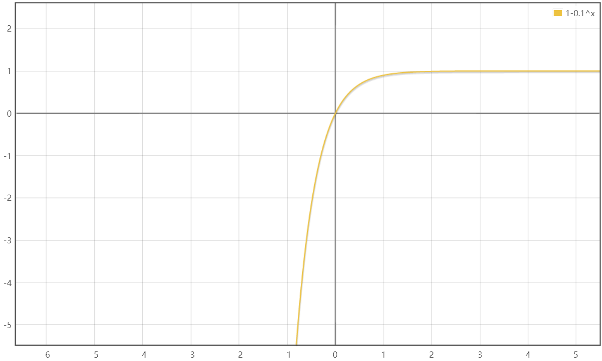

# 由1/3引发的悖论

### 0.9的循环等于1

```
1/3 = 0.33333...（无限循环）
1/3 * 3 = 1
0.3333... * 3 = 0.99999...（无限循环）

那么： 1 = 0.99999...（无限循环）
```

如上的证明，1/3 乘以 3 等于 1， 而 0.3的循环乘以3得到的结果就是0.9的循环，那么 1 与 0.9的循环也是1.

### 0.9的循环不等于1

0.9的循环可以表示为 0.9 + 0.09 + 0.009 + ...... + 0.00...009，由此：

> 定义一个数列 a<sub>1</sub> = 0.9，q = 0.1 的数列
>
> 则有 a<sub>1</sub> = 0.9， a<sub>2</sub> = 0.09，a<sub>3</sub> = 0.009
>
> 于是有 S<sub>n</sub> = 0.999999...（无限循环）= a<sub>1</sub> + a<sub>2</sub> +... + a<sub>n</sub> 
>
> 由此，S<sub>n</sub> = a<sub>1</sub> (1 - q<sup>n</sup>) / (1 - q) = 0.9 ( 1 - 0.1<sub>n</sub> ) / (1 - 0.1) = 1 - 0.1<sup>n</sup>
>
> 那么可以定义函数： f(x) = 1 - 0.1<sup>x</sup> 
>
可以作图：



> 由上图可值 f(x) 将无限趋近于 1，即 0.9的循环不等于1

### 0.9的循环与1 产生的悖论

综上所述，0.9的循环和1即相等，又不相等。我不敢放大胆了说，感觉我的知识体系出现了问题，他们矛盾了，怕怕。

---

> 如果有错，欢迎指出。 
>
> 邮箱：ningmonguo@foxmail.com